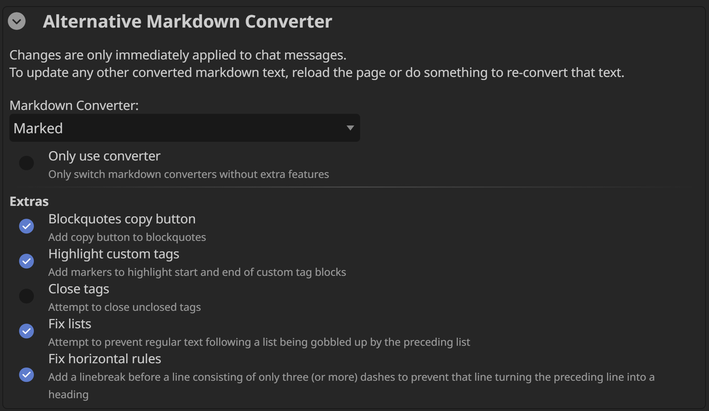

# SillyTavern - Alternative Markdown Converters

## Converters
Chose between multiple markdown converters:

- [ShowdownJS](https://showdownjs.com/) (vanilla ST)
- [Marked](https://marked.js.org/)
- [micromark](https://github.com/micromark/micromark)

Both Marked and micromark have better support for tables and nested lists than ShowdownJS. And possibly other quirks that one might be preferred over another.

## Extras

Additional tweaks, independend from the chosen markdown converter.

### Blockquote Copy Button
Adds a copy-to-clipboard button to all blockquotes, similar to code blocks.

### Highlight Custom Tags
Adds markers to highlight start and end of custom tag blocks (i.e., tags that are not standard HTML tags).

### Fix Lists
Attempts to prevent regular text following a list from being gobbled up by the list.

### Fix Horizontal Rules
Adds a linebreak before any line containing nothing but three (or more) dashes to prevent that line turning the preceding line into a heading.
